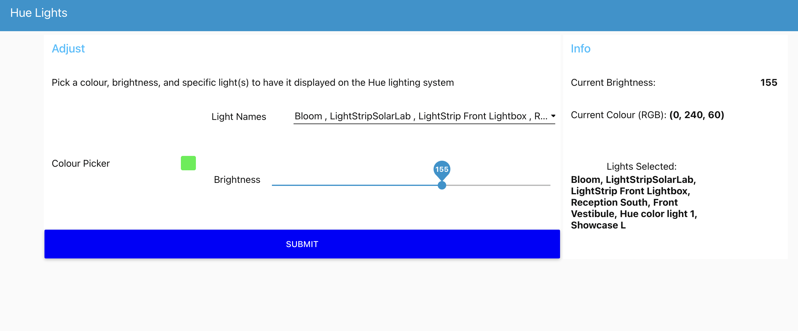

# mqtt-hue-webserver-control
This is a project utilizing MQTT, node-red, and the phue light library (in addition to one more) to control hue lights via API calls.

The user interface enables the user to control colour, brightness, lights to display on. There is also a submit button that allows the application to change one value (whether it be brightness, lights affected, or the RGB color profile) without needing to re-specifify all parameters.

<b>The local MQTT broker is an implementation of the <a href="https://mosquitto.org/">Mosquitto</a> Open-Source MQTT broker.</b>
